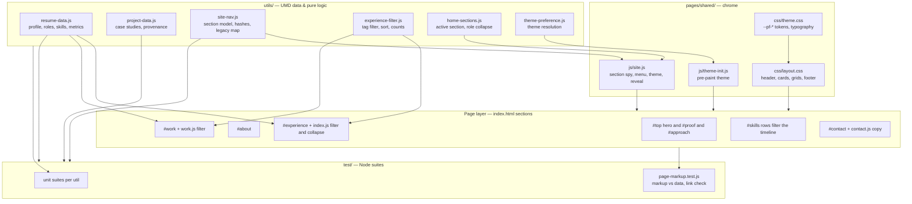
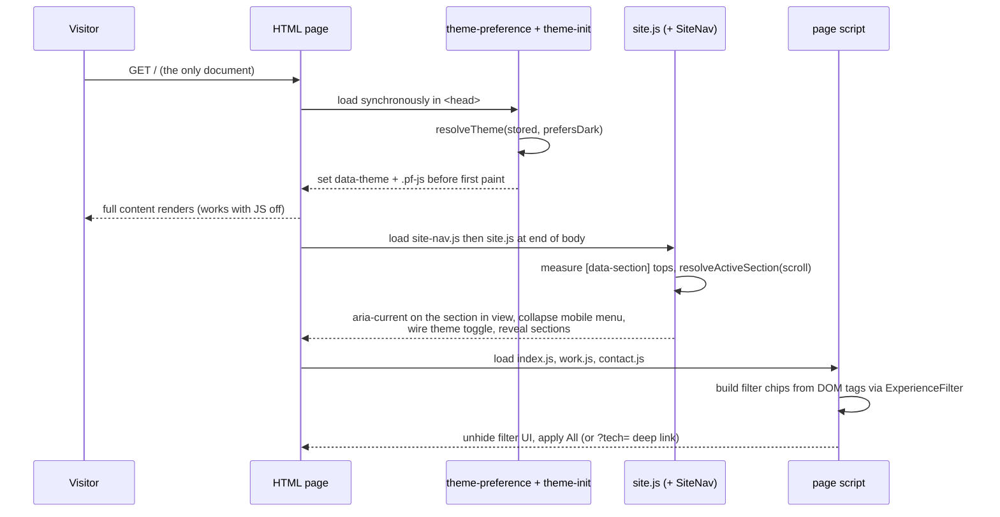

# Architecture — Jamie Tucker Portfolio

## 1. Shape of the system

A static, single-page site with no build step and no runtime dependencies. Three
layers, in strict dependency order:

1. **Data / logic layer** (`utils/*.js`) — UMD modules that are pure functions and
   plain data. They run identically in the browser (`window.ResumeData`) and in
   Node (`require`), which is what makes them unit testable.
2. **Shared presentation layer** (`pages/shared/`) — design tokens, chrome styles,
   and the DOM wiring for the header, theme, and reveal behaviour.
3. **Page layer** (`index.html` + `pages/index/`) — every section's hand-written
   HTML, plus the CSS and JS each section needs. The site is one document; the
   nav moves between sections rather than between pages.

Content lives in the HTML, not in JavaScript. The data modules are the canonical
record and the test fixture; the markup tests fail if the two disagree. This buys
no-JS robustness without giving up a single source of truth.

## 2. Component and dependency diagram

## 3. Request / render flow

## 4. Key relationships and rules

- **Tokens flow one way.** `theme.css` declares every `--pf-*` token. `layout.css`
  and page CSS consume them and never redeclare them. Adding a colour means adding
  a token in both `[data-theme='dark']` and `[data-theme='light']`.
- **Navigation has one source of truth.** `site-nav.js` owns the section list,
  their order, their labels, and their fragments. The markup repeats the links
  (for crawlers and no-JS visitors) and `page-markup.test.js` asserts the nav,
  the `[data-section]` targets, and the document order all agree.
- **Filtering is shared but scoped.** Both the timeline and the work grid use
  `experience-filter.js`, differing only in the attribute they read
  (`data-role-tags` vs `data-project-tags`) and the status wording. Because both
  now live on one page, each script looks its `data-filter-chips` host up inside
  its own container; a document-wide query would cross the wires.
- **Theme is applied twice on purpose.** `theme-init.js` sets it before paint to
  avoid a flash; `site.js` re-renders the toggle label and persists changes.
- **Provenance is enforced.** Every project's `roleId` must match a real role id;
  `findOrphanProjects()` is asserted empty in tests.

## 5. Current workflow (as built)

| Step | Where it happens |
| --- | --- |
| Visitor lands on `/` | `#top` hero, then `#proof` metrics and `#approach` |
| Wants the person | `#about` — story, principles, degree, interests |
| Wants depth | `#work` — eight case studies (problem / approach / outcome) |
| Wants proof | `#experience` timeline, filterable, `?tech=` still deep-links |
| Wants stack match | `#skills` rows, each filtering the timeline in place |
| Wants to talk | `#contact` — LinkedIn first, then email and the résumé |
| Anywhere on the page | Header nav marks the section in view; footer repeats it |

## 6. Extension points

- **New section:** add a `SECTIONS` entry in `site-nav.js`, add a
  `<section id="<key>" data-section>` in the same position in `index.html`, and
  add the nav link. The markup test fails if the three disagree.
- **New role or project:** append to `EXPERIENCE` / `PROJECTS` and add the matching
  markup block. `page-markup.test.js` fails until the markup exists.
- **New theme:** add a `[data-theme='name']` token block and extend
  `theme-preference.js` (`isValidTheme`, `nextTheme`) plus its unit tests.
