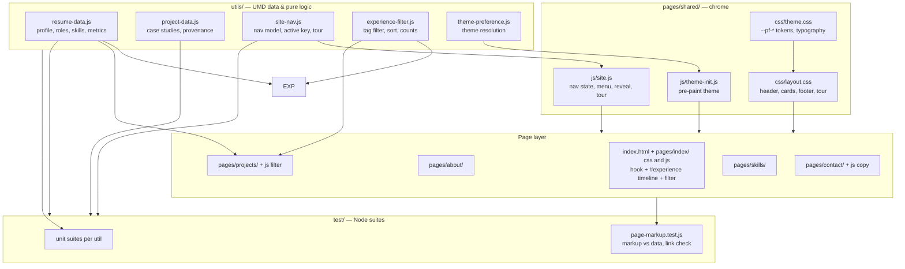
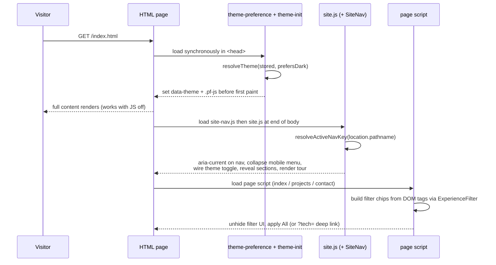

# Architecture — Jamie Tucker Portfolio

## 1. Shape of the system

A static, multi-page site with no build step and no runtime dependencies. Three
layers, in strict dependency order:

1. **Data / logic layer** (`utils/*.js`) — UMD modules that are pure functions and
   plain data. They run identically in the browser (`window.ResumeData`) and in
   Node (`require`), which is what makes them unit testable.
2. **Shared presentation layer** (`pages/shared/`) — design tokens, page chrome
   styles, and the DOM wiring that every page reuses.
3. **Page layer** (`index.html` + `pages/<name>/`) — hand-written HTML content plus
   the CSS and JS that only that page needs.

Content lives in the HTML, not in JavaScript. The data modules are the canonical
record and the test fixture; the markup tests fail if the two disagree. This buys
no-JS robustness without giving up a single source of truth.

## 2. Component and dependency diagram

## 3. Request / render flow

## 4. Key relationships and rules

- **Tokens flow one way.** `theme.css` declares every `--pf-*` token. `layout.css`
  and page CSS consume them and never redeclare them. Adding a colour means adding
  a token in both `[data-theme='dark']` and `[data-theme='light']`.
- **Navigation has one source of truth.** `site-nav.js` owns the page list, order,
  active-page resolution, and the prev/next tour. The markup repeats the links (for
  crawlers and no-JS visitors) and `page-markup.test.js` asserts the repetition
  matches `NAV_LINKS` exactly.
- **Filtering is shared.** Both the home timeline and the projects grid use
  `experience-filter.js`. They differ only in the attribute they read
  (`data-role-tags` vs `data-project-tags`) and the status wording.
- **Theme is applied twice on purpose.** `theme-init.js` sets it before paint to
  avoid a flash; `site.js` re-renders the toggle label and persists changes.
- **Provenance is enforced.** Every project's `roleId` must match a real role id;
  `findOrphanProjects()` is asserted empty in tests.

## 5. Current workflow (as built)

| Step | Where it happens |
| --- | --- |
| Visitor lands on `/` | `index.html` hero, metric strip, featured work |
| Wants proof | Same page: `#experience` timeline, optionally filtered by `?tech=` |
| Wants depth | Projects page case studies (problem / approach / outcome) |
| Wants stack match | Skills page rows, each deep-linking to `/index.html?tech=` |
| Wants to talk | Contact page email / copy button / LinkedIn / résumé PDF |
| Any page, any time | Header nav, footer sitemap, prev/next tour |

## 6. Extension points

- **New page:** add a `NAV_LINKS` entry, create `pages/<name>/{html,css[,js]}`,
  copy the header/footer block, add the nav link to every other page. Tests will
  tell you which page you forgot.
- **New role or project:** append to `EXPERIENCE` / `PROJECTS` and add the matching
  markup block. `page-markup.test.js` fails until the markup exists.
- **New theme:** add a `[data-theme='name']` token block and extend
  `theme-preference.js` (`isValidTheme`, `nextTheme`) plus its unit tests.
