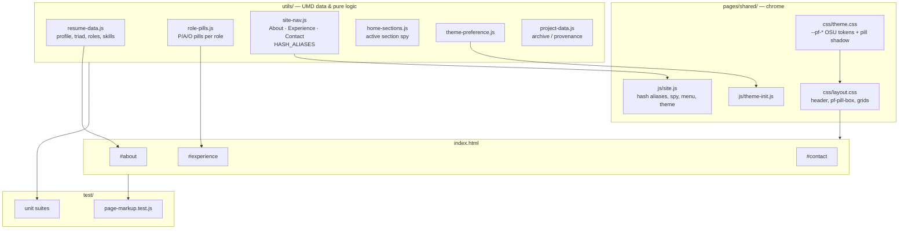
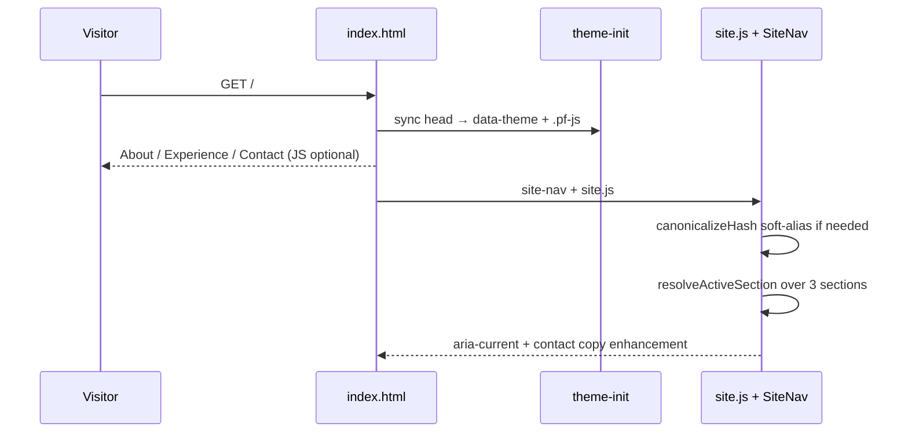

# Architecture — Jamie Tucker Portfolio

## 1. Shape of the system

A static, single-page site with no build step and no runtime dependencies. Three
layers, in strict dependency order:

1. **Data / logic layer** (`utils/*.js`) — UMD modules that are pure functions and
   plain data. They run identically in the browser and in Node for unit tests.
2. **Shared presentation layer** (`pages/shared/`) — design tokens, chrome styles,
   header/theme/reveal wiring, and hash soft-aliasing.
3. **Page layer** (`index.html` + `pages/index/`) — three major sections: About,
   Experience, Contact.

Content lives in the HTML. Data modules are the canonical record; markup tests
fail if the two disagree.

## 2. Component and dependency diagram

## 3. Request / render flow

## 4. Key relationships and rules

- **Tokens flow one way.** Structural tokens (`--pf-card-shadow`, `--pf-pill-radius`)
  may be added; **scarlet / gray / white values stay locked** unless
  `color-contrast.js` is updated in the same change.
- **Nav + aliases.** `site-nav.js` owns `SECTIONS` and `HASH_ALIASES`. `site.js`
  rewrites retired fragments with `history.replaceState`.
- **Pill boxes.** Shared `.pf-pill-box` chrome; role copy lives in `role-pills.js`
  and the Experience markup.
- **Photo contract.** `PROFILE.photoPath` → `/media/images/pro_headshot.jpeg`.
- **Skip link.** `.pf-skip-link` stays the first focusable control in `index.html`.
  Position only: `left: 50%` and `top: calc(var(--pf-header-h) / 2)`, with
  `translate(-50%, -50%)` on `:focus`, so keyboard users get a control centered
  on the sticky header. Colors, padding, and type stay on the existing tokens.

## 5. Current workflow (as built)

| Step | Where |
| --- | --- |
| Land / story | `#about` — headshot, résumé, triad with proof bullets, education |
| Proof of work | `#experience` — three role pills, compact skills, interests |
| Talk | `#contact` — LinkedIn, then email |

## 6. Extension points

- New section: `SECTIONS` + markup + nav (prefer keeping three for skim).
- New role: `EXPERIENCE` + `ROLE_PILLS` + Experience article.
- New alias: `HASH_ALIASES` entry pointing at a live hash.
