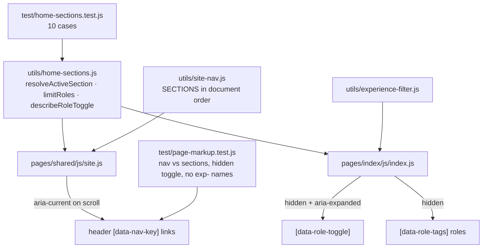

# Page Length Controls

## What it does

The site is one page carrying the whole résumé, so length is the main usability
risk. Two controls keep it navigable, and one naming rule keeps it readable.

1. **Section spy in the header nav.** The header offers one link per section —
   Proof, What I do, About, Work, Experience, Skills, Contact — and marks the
   section currently in view with `aria-current`. They are ordinary anchor
   links, so they work before (and without) JavaScript. (This replaced a
   separate sticky sub-nav: once the header nav pointed at the same sections,
   two bars of identical links was one too many.)
2. **Collapsed earlier roles.** The timeline opens showing only the newest role
   with a "Show 2 earlier roles" button beneath it. Applying a technology filter
   overrides the collapse, because someone filtering by React asked to see every
   role that used React. With JavaScript disabled the button stays hidden and all
   three roles are on the page.
3. **Section-owned class names.** The timeline's `exp-*` classes, inherited from
   the deleted experience page, are `home-*` (`home-role`, `home-timeline`,
   `home-chip`, `home-filter`), and each folded-in section kept its own prefix
   (`about-`, `proj-`, `skills-`, `contact-`) so a class still names the block
   that owns it.

## How it was implemented

- The decisions are arithmetic, so they live in `utils/home-sections.js` as pure
  functions and are unit tested in Node: which section is active for a given
  scroll position and sticky offset, which roles to show, and what the toggle
  should say.
- `site.js` supplies the DOM for the spy: it measures section tops on every
  animation frame it paints (the collapse and both filters move them) and takes
  the offset from the live header height rather than hard-coding it.
- `--pf-header-h` in `theme.css` is the single source for the header height.
  `[data-section]` carries `scroll-margin-top` so a jump link does not land
  behind the sticky header.

## How to edit it

- **Add a section:** add it to `SECTIONS` in `utils/site-nav.js`, give the
  `<section>` a matching `id` and `data-section`, and add the nav link. The
  markup test fails if the three disagree or if the order does not match.
- **Change how many roles stay visible:** `COLLAPSED_ROLE_COUNT` in
  `utils/home-sections.js`. The button label and the status line follow.
- **Reword the toggle:** `describeRoleToggle` in the same file; its labels are
  asserted in `test/home-sections.test.js`.
- **Change when the spy switches sections:** `resolveActiveSection`, same file.
  The `atBottom` branch exists so a short trailing section can still win.

Run `npm test` after any edit; eight suites must stay green.
