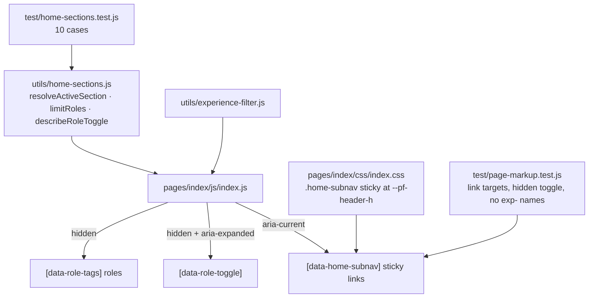

# Home Page Length Controls

## What it does

The home page now carries the whole work history, which makes it the longest page
on the site. Two controls keep it navigable, and one rename keeps it readable.

1. **Section sub-nav.** A sticky bar under the header offers five jumps — Proof,
   What I do, Selected work, Experience, Education — and marks the section
   currently in view with `aria-current="true"`. They are ordinary anchor links,
   so they work before (and without) JavaScript.
2. **Collapsed earlier roles.** The timeline opens showing only the newest role
   with a "Show 2 earlier roles" button beneath it. Applying a technology filter
   overrides the collapse, because someone filtering by React asked to see every
   role that used React. With JavaScript disabled the button stays hidden and all
   three roles are on the page.
3. **Home-owned class names.** The timeline's `exp-*` classes, inherited from the
   deleted experience page, are now `home-*` (`home-role`, `home-timeline`,
   `home-chip`, `home-filter`, `home-education`), matching the page that owns
   them.

## How it was implemented

- The decisions are arithmetic, so they live in `utils/home-sections.js` as pure
  functions and are unit tested in Node: which section is active for a given
  scroll position and sticky offset, which roles to show, and what the toggle
  should say.
- `index.js` supplies the DOM: it measures section tops on every animation frame
  it paints (the collapse and the filter both move them), and re-measures the
  sticky offset from the live header and sub-nav heights rather than hard-coding
  it.
- `--pf-header-h` in `theme.css` is the single source for the header height, used
  by `layout.css` for the header itself and by `index.css` for `position: sticky;
  top`. `[data-section]` carries `scroll-margin-top` so a jump link does not land
  behind the two sticky bars.

## How to edit it

- **Add a section to the sub-nav:** give the `<section>` an `id` and
  `data-section`, then add a link with `href="#<id>"` and
  `data-subnav-link="<id>"`. The markup test fails if the two ever disagree.
- **Change how many roles stay visible:** `COLLAPSED_ROLE_COUNT` in
  `utils/home-sections.js`. The button label and the status line follow.
- **Reword the toggle:** `describeRoleToggle` in the same file; its labels are
  asserted in `test/home-sections.test.js`.
- **Restyle the bar:** `.home-subnav*` in `pages/index/css/index.css`. Keep
  `top: var(--pf-header-h)` so it stays pinned under the header.

Run `npm test` after any edit; eight suites must stay green.
