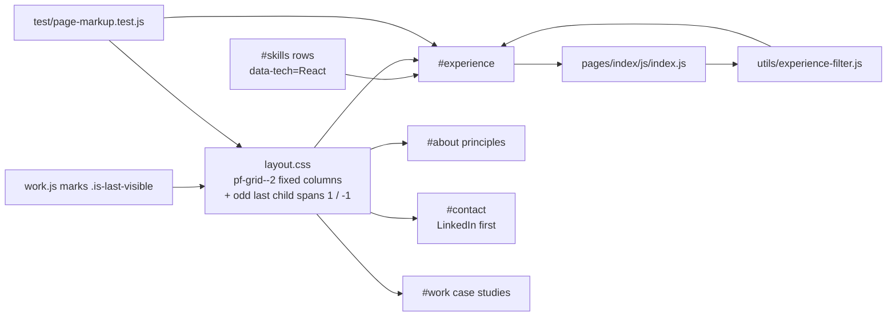

# Home Timeline and Card Grid Parity

## What it does

Three related changes to how the site presents proof.

1. **The page holds the full work history.** The old "Career path" list
   (dates and job titles only) was replaced by the complete timeline that used to
   live on the Experience page: every résumé bullet, every technology tag, and the
   technology filter, under the `#experience` anchor. The standalone Experience
   page is gone; the skills rows filter the timeline in place (and `?tech=React`
   still works as an external deep link), scrolling it into view on arrival.
2. **Card grids never strand a lone card.** `pf-grid--2`, `--3`, and `--4` pin a
   fixed column count instead of using `auto-fit`, so the browser can no longer
   pick a count that leaves one card alone on the last row. When a grid genuinely
   holds an odd number of cards (the contact channels are three), the trailing
   card spans the full row so it reads as intentional.
3. **LinkedIn is the fastest contact channel.** It is the first card and carries
   the "fastest" label; email moved to second with a secondary button. The
   Location card was removed and the location moved into the "What I'm looking
   for" panel so nothing was lost.

## How it was implemented

- `pages/experience/` was deleted. Its script became `pages/index/js/index.js`
  (unchanged logic) and its CSS moved into `pages/index/css/index.css`. The
  `exp-*` class names later became `home-*` so the markup, CSS, and JS still read
  as one block.
- `utils/site-nav.js` lost its `experience` entry; the whole module later became
  the section model behind the single-page nav.
- The grid rules live in `pages/shared/css/layout.css`. Because `:last-child`
  counts hidden cards, the projects filter adds `.is-last-visible` to the real
  trailing card when an odd number matches.

## How to edit it

- **Add or change a role:** edit the `<li class="home-role">` block in
  `index.html`. Keep `data-role-tags` in sync with the `pf-tag` list — the filter
  reads the attribute, and `test/page-markup.test.js` compares both against
  `utils/resume-data.js`.
- **Add a technology chip:** add the tag to `data-role-tags`; chips are built from
  the DOM at load.
- **Add a card to a grid:** nothing to configure. An even count fills both
  columns; an odd count spans the last card.
- **Add a contact channel:** copy an existing `<article class="pf-card">` in the
  `#contact` section of `index.html`. Only one card may carry the "fastest" label.

Run `npm test` after any edit; the markup suite fails on drift.
