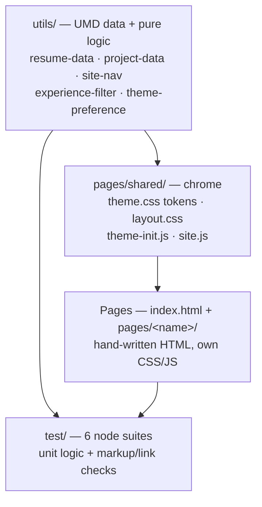

# Feature Overview — Multi-Page Portfolio Architecture

## What it does

Turns the résumé into a six-page recruiter-facing site: **Home** (the hook),
**About**, **Experience**, **Projects**, **Skills**, **Contact**. Every page shares
one header, footer, theme, and prev/next tour, so a visitor can never reach a dead
end. The home page leads with a single claim, four proof numbers, an availability
badge, and two calls to action. Experience and Projects can be filtered by
technology; Skills deep-links each technology to the role that proves it
(`experience.html?tech=React`). Contact offers email with copy-to-clipboard,
LinkedIn, and the résumé PDF.

## How it was implemented

Three layers, no build step, no runtime dependencies.

- **`utils/*.js`** are UMD modules: the same file is a browser global and a Node
  `require`, so every decision (which nav link is active, which roles match a tag,
  which theme to apply) is unit tested rather than trusted.
- **`pages/shared/css/theme.css`** owns every `--pf-*` token, the universal font
  stack, and both `[data-theme]` palettes. `layout.css` builds the shared chrome
  from those tokens. Page CSS never redeclares a token.
- **Content is hand-written HTML**, so pages render fully with JavaScript disabled.
  JS only adds filtering, theming, the tour, and reveal animation.
- **`test/page-markup.test.js`** closes the duplication gap: it asserts that every
  role, highlight, date range, metric, project, and skill in the data modules
  appears in the markup, that every page repeats the nav exactly as `site-nav.js`
  defines it, and that no internal link or asset 404s.

## How to edit it

| To change | Edit | Then |
| --- | --- | --- |
| A job, bullet, or skill | `utils/resume-data.js`, then the matching page markup | `npm test` |
| A case study | `utils/project-data.js` + `pages/projects/html/projects.html` | `npm test` |
| Colours, spacing, fonts | `pages/shared/css/theme.css` tokens only | reload |
| Header, footer, cards | `pages/shared/css/layout.css` | reload |
| One page's layout | `pages/<name>/css/<name>.css` | reload |
| Add a page | `NAV_LINKS` in `utils/site-nav.js`, create `pages/<name>/`, copy the header/footer block into it and add its link to the other five pages | `npm test` |

The tests are the guardrail: they fail with the exact page and missing string when
markup and data drift apart, or when a nav link is forgotten on one page.

Run locally with `npx serve .` from the repository root (root-absolute paths need a
server, not `file://`). Diagram source: `diagrams/site-architecture.mmd`.
