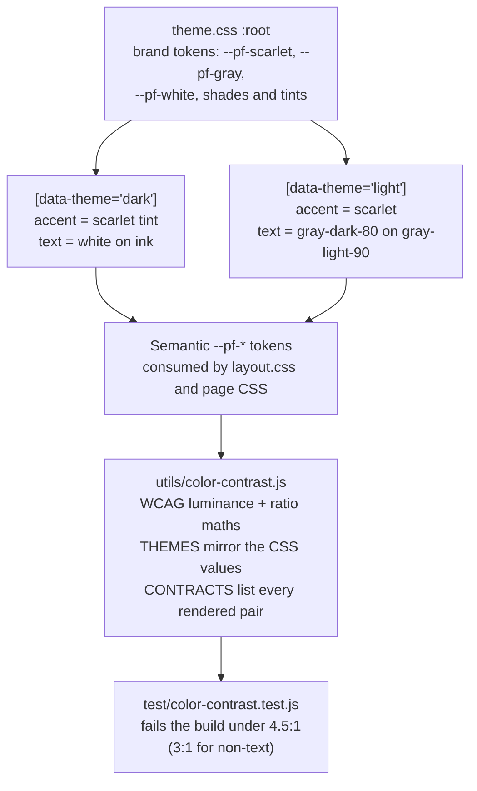

# Feature Overview — Ohio State Brand Theme

## What it does

Re-skins the whole site in Ohio State's primary palette — scarlet `#ba0c2f`,
gray `#a7b1b7`, white `#ffffff` — in both dark and light mode, while every text
and control pair provably meets [WCAG 2.1 AA](https://www.w3.org/WAI/WCAG21/Understanding/contrast-minimum.html).
It also removes the "Full-Stack Software Engineer" subheader from the navigation
(it wrapped badly on phones) and pins the home page's four featured cards to a
2×2 grid instead of letting them pack 3 + 1.

The catch the palette creates: scarlet on dark ink is only **2.7:1**, far below
the 4.5:1 AA minimum. So dark mode uses a scarlet *tint* for link and accent
text, while filled buttons keep solid scarlet with white text (6.6:1) plus a
tinted border so the control boundary stays visible (WCAG 1.4.11).

## How it was implemented

- **Brand values live once**, in `:root` inside `pages/shared/css/theme.css`. The
  per-theme blocks only map them onto semantic tokens, so no page CSS ever names
  a raw colour.
- **New tokens**: `--pf-accent-solid` (filled controls), `--pf-accent-solid-hover`,
  `--pf-accent-solid-border`. Anything with white text on it uses `-solid`, never
  `--pf-accent`, because the dark-mode accent is a light tint.
- **`utils/color-contrast.js`** implements the WCAG relative-luminance formula,
  ratio truncation (4.49 must not round up to a pass), and alpha compositing so
  translucent surfaces are measured as rendered. It mirrors the resolved token
  values and lists 16 real foreground/background contracts per theme.
- **`test/color-contrast.test.js`** audits all 32 contracts. The lowest ratio on
  the site is now 4.61:1.

## How to edit it

| To change | Edit | Then |
| --- | --- | --- |
| A brand colour | the `:root` block in `theme.css` **and** `BRAND` in `utils/color-contrast.js` | `npm test` |
| A theme mapping | the `[data-theme='…']` block **and** the matching `THEMES` entry | `npm test` |
| A new coloured pairing | add a row to `CONTRACTS` with its WCAG level | `npm test` |
| Featured card columns | `.pf-grid--2` in `pages/shared/css/layout.css` | reload |

The two sources must stay in step: the CSS renders the colour, the module proves
it is legible. If a change drops a pair below its threshold, the suite names the
pair, the ratio, and the requirement. Diagram source:
`diagrams/theme-token-flow.mmd`. Palette reference:
[BUX primary colors](https://bux.osu.edu/color/primary-colors/) and
[WebAIM on contrast](https://webaim.org/articles/contrast/).
