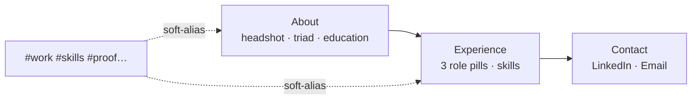

# Recruiter Concise Consolidation (Milestone 6)

Collapses the seven-section portfolio into three skimmable sections so recruiters
and non-tech viewers need less vertical scrolling, without changing the Ohio
State colour scheme.

## What it does

`index.html` is now **About → Experience → Contact**:

1. **About** — Hero (claim, status, résumé CTA) merged with a concise “How I got
   here,” a Matt Farley–style triad (“Stand up client architecture,” “Make big
   surfaces fast,” “Turn research into UI”) with former proof metrics as bullets,
   and a compact education panel. Uses `pro_headshot.jpeg`.
2. **Experience** — Three YouTube-inspired **pill boxes** (Playables, Search
   Intelligence, Modern Creators) as problem → approach → outcome; compact
   skills-by-category; “Away from the keyboard” without CTAs.
3. **Contact** — LinkedIn (fastest) and Email pills only.

Technology filters are removed. Retired hashes (`#work`, `#skills`, `#proof`,
`#approach`, `#top`) soft-alias onto live sections via `SiteNav` + `site.js`.

## How it was implemented

| Layer | Change |
| --- | --- |
| Data | `site-nav.js` three sections + `HASH_ALIASES`; `role-pills.js` pill model; `PROFILE.photoPath` + `APPROACH_TRIAD` |
| Markup | Rewrote `index.html`; dropped work/skills filter UIs |
| CSS | `.pf-pill-box`, `--pf-card-shadow`, `--pf-pill-radius`; denser masthead; colours untouched |
| JS | `setupHashAliases()`; removed filter script loads |
| Tests | `role-pills.test.js`; updated `site-nav` + `page-markup` |

## How to edit

1. **Copy / metrics** — Edit `utils/resume-data.js` (`APPROACH_TRIAD`,
   `IMPACT_METRICS`) then mirror in About markup.
2. **Role pills** — Edit `utils/role-pills.js`, then the matching
   `data-role-pill` article in Experience. `npm test` fails on orphans or missing
   roles.
3. **Nav** — Change `SECTIONS` / `HASH_ALIASES` in `utils/site-nav.js` and the
   header/footer links together.
4. **Chrome** — Structural tokens in `theme.css`; pill layout in `layout.css`.
   Never recolour scarlet/gray/white without updating `color-contrast.js`.

Diagram source: `diagrams/recruiter-concise-consolidation.mmd`.
