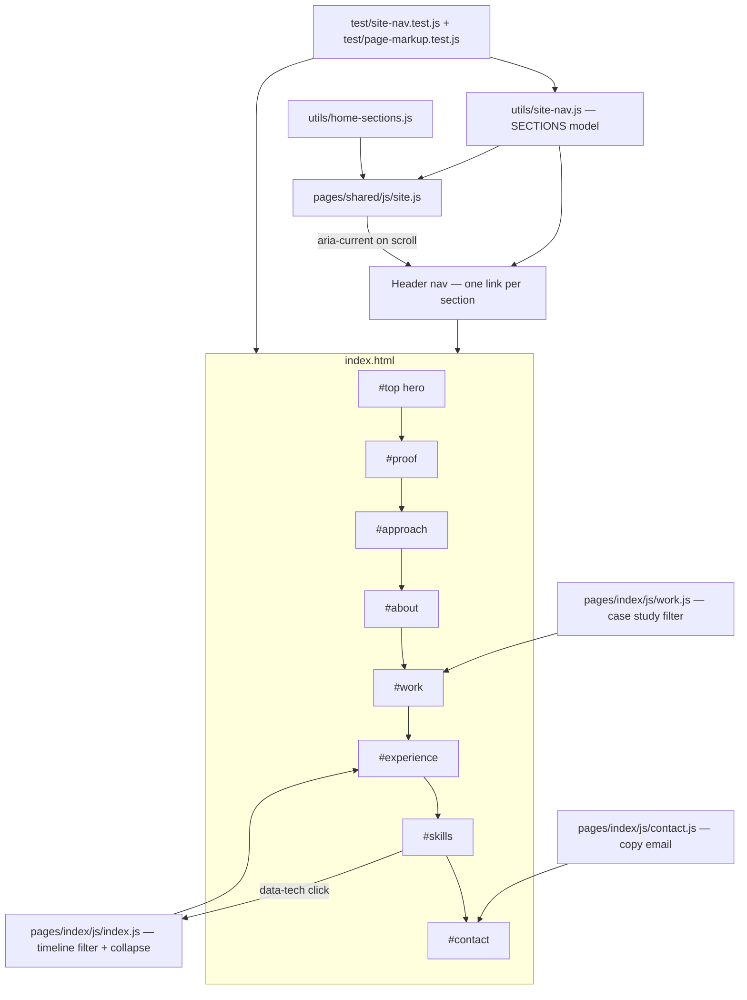

# Single-Page Architecture

## What it does

The site is now one page. `index.html` holds every section a visitor used to
reach by navigating: the hero, **Proof**, **What I do**, **About**, **Work**,
**Experience**, **Skills**, and **Contact**. The header nav no longer loads
documents — each link is a fragment (`#work`) that jumps to a section, and the
link for the section in view is marked with `aria-current`. Nothing about the
palette or the components changed; the sections keep the layout they had as
pages, so the page reads as one continuous document on desktop and collapses to
a single column with a hamburger menu on a phone.

Both filters survived the move: the timeline still filters by technology and
collapses older roles, and the work grid still filters case studies. A skills
row now filters the timeline in place instead of loading a new URL.

## How it was implemented

- `utils/site-nav.js` was rewritten from a page model into a **section model**:
  an ordered list of `{ key, label, hash }` plus `normalizeHash`,
  `resolveSectionKey`, `getAdjacentSections`, and a `LEGACY_PATHS` map recording
  where each retired page's content went.
- `site.js` replaced its page-based active link and its prev/next tour with a
  scroll-spy built on `HomeSections.resolveActiveSection`, and the mobile menu
  now closes itself when a link is clicked, since no navigation happens.
- Each retired page's CSS and JS moved under `pages/index/` (`about.css`,
  `work.css`, `skills.css`, `contact.css`, `work.js`, `contact.js`). Every page
  `<h1>` became the `<h2>` that opens its section; the hero keeps the only `h1`.
- Both filters use the same `data-filter-chips` hook, so each script now looks
  its hooks up **inside its own container**. A document-wide query would hand
  the timeline the work grid's chips.

## How to edit it

- **Add a section:** add an entry to `SECTIONS` in `utils/site-nav.js`, add a
  `<section id="<key>" data-section>` in document order, and add the nav link.
  The markup test fails if the three disagree or if the order does not match.
- **Reorder sections:** move both the `SECTIONS` entry and the markup; order is
  asserted.
- **Change a nav label:** edit `SECTIONS`; labels over 12 characters fail the
  test because they break the header on tablets.
- **Add a stylesheet or script:** put it in `pages/index/` and link it; the test
  checks every referenced file exists.

Run `npm test` after any edit; eight suites must stay green.
